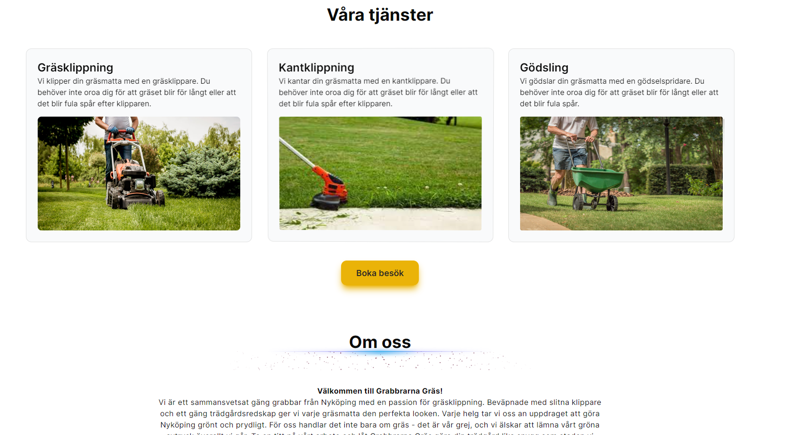

# Grabbarna Gräs

Grabbarna Gräs is an innovative booking platform designed to revolutionize the way we maintain our gardens. Utilizing the latest in web development technologies, including Next.js and Prisma, Grabbarna Gräs offers a seamless and user-friendly service where customers can effortlessly book grass cutting services based on the size of their garden, with prices automatically adjusting. This platform is not just a way for my little brother and his friends to organize their services, but also an opportunity for customers to enjoy more free time in a well-maintained garden, all while supporting young entrepreneurship.

## Table of Contents

- [Installation](#installation)
- [Usage](#usage)
- [Features](#features)
- [How to use](#how-to-use)
- [Technologies](#technologies)
  - [NextJS](#nextjs)
  - [Prisma](#prisma)
- [Images](#images)

## Installation

- Clone git repository
- Run `npm install`
- Run `prisma generate`
- Rename `.env.example` to `.env`
- Set `.env` variables
- Run `prisma db push`
- Run `npm run dev`

## Usage

Welcome to the Grass Cutting Booking System - a specialized booking platform designed to help manage and schedule grass cutting services. Developed using cutting-edge technologies including `shadcn/ui`, `Aceternity UI` for the user interface, and leveraging Prisma with NextJS for the backend, this system offers an intuitive and user-friendly way for clients to book grass cutting services based on the size of their garden and select available times based on the schedule of the service providers (in this case, my little brother and his friends).

### Features

- **Home Page Description**: Get to know more about our grass cutting services and the team behind them.
- **Booking**: Seamlessly book services with dynamic pricing based on garden size.
- **Schedule Selection**: Choose from available times that fit both your schedule and ours.
- **Admin Panel**: A secure, password-protected page for monitoring bookings and managing available dates and times.

### How to use

- **End user**: To book a service, visit the home page and click Book. Follow the prompts to select the service based on the size of your garden, the price will adjust automatically. Then, choose from the predetermined times when service is available.
- **Service providers**: For administrative access, navigate to /admin and enter the required password to monitor bookings and manage availability.

## Database Schema

The Prisma schema defines a database schema for a grass cutting booking system with two main models:

- **Booking**: Represents individual bookings, including details like garden size, address, client information, booking creation time, completion status, and price. Each booking is associated with a specific day.
- **Day**: Represents days on which bookings can be made, including date information and a relationship to all bookings made for that day, along with a limit on the maximum number of bookings allowed.

The schema utilizes MySQL as the database provider and includes settings for automatic ID generation, default values for certain fields, and an indexing strategy for efficient data retrieval.

Full schema available at: [Prisma DB Schema](./prisma/schema.prisma)

## Technologies

### NextJS

Next.js is an open-source React framework that enables developers to build server-side rendered and statically generated web applications with ease. It offers features like file-based routing, API routes, and automatic code splitting, making it a powerful and efficient choice for developing high-performance and scalable web projects.

#### Next.js Server Actions (API Routes)

Next.js API Routes provide the functionality to handle backend logic directly within a Next.js application. These routes enable server-side operations like interacting with a database, processing form submissions, or handling authentication, all within the familiar Next.js framework. By organizing these routes under the `pages/api` directory, Next.js treats them as API endpoints, allowing for a seamless integration of frontend and backend logic in a single application. This approach simplifies development, deployment, and hosting, making it an efficient choice for building web applications.

#### Async React Components

In modern web development, delivering a dynamic and responsive user experience often requires fetching, displaying, and updating data based on user interactions or other events. Async React components utilize JavaScript's asynchronous capabilities, such as Promises and the async/await syntax, to handle these operations without blocking the UI's rendering. By leveraging the React hooks `useState` and `useEffect`, these components can asynchronously fetch data from an API, process it, and update the state of the application, all while ensuring the interface remains responsive and up-to-date.

#### Integration in the Project

The project utilizes Next.js API Routes to encapsulate server-side logic, such as managing bookings and user interactions, within the application. These routes serve as the backend endpoints that the frontend interacts with, providing a streamlined way to handle data processing and storage. Async React components in the project leverage these API routes to dynamically fetch and display data, allowing for real-time updates and interactive user experiences without the need for a page reload. This architecture facilitates the creation of a fully integrated web application that combines the efficiency of server-side processing with the interactivity of client-side React components.

### Prisma

Prisma is an open-source next-generation ORM (Object-Relational Mapping) tool for Node.js and TypeScript, designed to make database access easy and intuitive. It offers a powerful query engine and auto-generated and type-safe database client, streamlining database operations and development workflows for modern applications.

## Images

**HomePage**:
**Services**:
**Booking**:
